# Documentación de nuestro proyecto
- JavaScript (Backend)
- npm
- [Node.js](#node)
- [Nodemon](#nodemon)
- [Express](#express)
- [`dotenv (.env)`](#dotenv)
- [MongoDB](#mongodb)
  - [Métodos](#métodos)
- Uso de la API
  - [GET](#get)
  - POST
  - PUT
  - DELETE
- [Test de Validaciones](#testdevalidaciones)
- [Diagramas](#diagramas)  
  - [Diagrama de Flujo](#diagrama-de-flujo)  
  - [Diagrama de Secuencia](#diagrama-de-secuencia)  
- Autoras

## Node JS (https://nodejs.org/es)
 Entorno en tiempo de ejecuciónde de JS de código abierto y multiplataforma que perite a los desarrolladores construir aplicaciones de servidor escalables y de alta velocidad.

 ### Elementos claves: 
 #### **package.json:** archivo que se crea dentro de cada proyecto nodejs. Es clave y **no** debe eliminarse de la carpeta de cada proyecto que desarrollemos 
  
 #### **node_modules** se creará cuando comencemos a instalar librerias, frameworks y otras dependencias para utilizar en nuestros proyectos Node.js

 Para inicializar el proyecto en la terminal deberemos escribir:
 ```
    $ npm init -y
  ```
## Nodemon
Dependencia que nos ayuda a automatizar la ejecución de nuestra página web y no andar reiniciando el servidor por cada cambio realizado en nuestro proyecto.
- En consola instalamos nodemon
    ```
        $ npm install nodemon
     ```
- En package.json modificamos el scrip start y agregamos end
    ```javascript
       "scripts":{
                    "start": "node --watch ./ruta_del_server.js",
                    "end": "kill all -9 node"
                }
    ```
- Luego en consola levantamos la app y listo.
    ```
        $ npm start 
     ```
## Express
Es un framework que nos proporciona una amplia gama de funcionalidades para el manejo de rutas, gestión de peticiones y respuestas HTTP, de integración con BD, en nuestro caso MongoDB, y middleware para validar datos, autenticación y seguridad entre otras opciones. Para mayor información por favor visite https://expressjs.com/
- En consola instalamos express
    ```
        $ npm install express
     ```
- En el archivo .js escribimos lo siguiente:
     ```javascript
        const express = require('express');
        const app = express();
        //Puerto del localhost
        const PORT = 3000;
        
        //Ruta Home
        app.get('/', (req, res) => {
            res.send("välkommen");
        });

        //Middleware para rutas inexistentes
        app.use((req, res ) => {
            res.status(404).send("Page Not Found");
        });

        //Módulo de escucha
        app.listen(PORT, () => {
            console.log(`Servidor funcionando en ${PORT}`);
        });
     ```
## DotEnv
Es un módulo sin dependencias que carga variables de entorno como puertos del servidor, URL de conexión a BDs, claves (passwords, API keys), modo del entorno (desarrollo, produccion, testeo, etc) desde un archivo .env a procces.env y ***debe estar en el .gitignore*** 

- Instalación en consola
    ```
        $ npm install dotenv
     ```
- En el árbol de archivos, creo el archivo .env en la ruta principal del proyecto
  
  


- En el archivo .js escribimos lo siguiente:
     ```javascript
            const dotenv = require('dotenv');
            dotenv.config();
     ```


## MongoDB 
- Nos logeamos en https://account.mongodb.com/account/login 
- Creamos el proyecto Supermercado.  
- En Compass que previamente instalamos en nuestro Pc generamos nuestra base de datos
- Conectamos nuestra BD con nuestro cluster.
-  Una vez realizada la conexion agregamos nuestro set de datos
  

Ya en nuestro proyecto instalamos a través de la consola MongoDB Driver
 ```
    $ npm install mongodb
  ```

### Métodos
 | Operador | Método | Descripción |
 |:---------|:--------|:-------------|
 | .connect() | client.connect() | Nos permite conectarnos al motor de MongoDB |
 | .disconnect() | client.close() | Nos permite desconectarnos del motor de MongoDB |
 | .db() | client.db(database) | Una vez conectados a MongoDB, nos permite seleccionar la base de datos|
 | .collection() | db.collection(collectionName) | Seleccionada a base de datos nos permite elegir con que coleccion trabajar|
 | .find() | db.collection().find(obj) | Busca un documento en la colección actual o devuelve todos los documentos |
 | .findOne() | db.collection().findOne(obj) | Busca un documento en la collección actual, de acuerdo al objeto informado |


## API RESTful
### GET /
- Ruta principal que devuelve un mensaje

```js
    app.get('/', (req, res) => {
        res.status(200).end("🛒 <mensaje> 🛒");
    });
```
 - Respuesta de estado: 200, en el get significa que el recurso ha sido recuperado y se transmite el mensaje al body.


## Test de validaciones

- En este caso, la ruta base de la API REST puede variar en nuestro entorno de pruebas.
  

| URL | Método | Descripción | Resultado esperado | Código |
|:---------:|:--------:|:-------------:|:------------:|:--------:|
| http://localhost:3010/ | URL principal | GET | Devuelve 🛒 Bienvenido a APImarket 🛒 | 200 |
| http://localhost:3010/productos | URL gral para vizualisar todos los productos | GET | Colección de datos completa | 200 |
| http://localhost:3010/producto | URL gral para vizualisar todos los productos | GET | La página que busca no existe. | 404 |
| http://localhost:3010/productos | URL gral para vizualisar todos los productos | GET | No puedo mostrar los productos. | 500 |

Para saber mas sobre codigos de estados, te recomendamos visitar https://developer.mozilla.org/es/docs/Web/HTTP/Reference/Status

## Diagramas
### Diagrama de Flujo

Este diagrama muestra el flujo general para la configuración y ejecución de la API RESTful, desde la instalación de dependencias hasta la definición y escucha de las rutas.

```mermaid
%% Diagrama de flujo 
graph TD
  style A fill:#0d6e36,stroke:#fff,stroke-width:2px,color:#ffffff,font-weight:bold
  style B fill:#0d6e36,stroke:#fff,stroke-width:2px,color:#ffffff,font-weight:bold
  style C fill:#0d6e36,stroke:#fff,stroke-width:2px,color:#ffffff,font-weight:bold
  style D fill:#0d6e36,stroke:#fff,stroke-width:2px,color:#ffffff,font-weight:bold
  style E fill:#0d6e36,stroke:#fff,stroke-width:2px,color:#ffffff,font-weight:bold
  style F fill:#0d6e36,stroke:#fff,stroke-width:2px,color:#ffffff,font-weight:bold
  style G fill:#0d6e36,stroke:#fff,stroke-width:2px,color:#ffffff,font-weight:bold
  style H fill:#0d6e36,stroke:#fff,stroke-width:2px,color:#ffffff,font-weight:bold
  style I fill:#0d6e36,stroke:#fff,stroke-width:2px,color:#ffffff,font-weight:bold
  style J fill:#0d6e36,stroke:#fff,stroke-width:2px,color:#ffffff,font-weight:bold
  style K fill:#0d6e36,stroke:#fff,stroke-width:2px,color:#ffffff,font-weight:bold
  style L fill:#0d6e36,stroke:#fff,stroke-width:2px,color:#ffffff,font-weight:bold
  style M fill:#0d6e36,stroke:#fff,stroke-width:2px,color:#ffffff,font-weight:bold
  style N fill:#0d6e36,stroke:#fff,stroke-width:2px,color:#ffffff,font-weight:bold
  style O fill:#0d6e36,stroke:#fff,stroke-width:2px,color:#ffffff,font-weight:bold

  A[Inicio] --> B[Instalación de MongoDB Driver + Express.js]
  B --> C[Requerir dotenv y configurar variables de entorno]
  C --> D[Crear archivo mongodb.js con funciones de conexión/desconexión]
  D --> E[Configurar servidor Express y middlewares]
  E --> F[Definir rutas de API]

  F --> G[GET /productos → Obtener todos los productos]
  F --> H[GET /productos/:cod → Buscar por código]
  F --> I[GET /categoria/:cat → Buscar por categoría]
  F --> J[GET /precio/:precio → Buscar por precio]
  F --> K[POST /productos → Crear nuevo producto]
  F --> L[PUT /productos/:cod → Reemplazar producto entero]
  F --> M[PATCH /productos/:cod → Modificar parcialmente]
  F --> N[DELETE /productos/:cod → Eliminar producto]

  N --> O[Middleware 404 y escucha en puerto]
```


***

### Diagrama de Secuencia
Este diagrama ilustra la interacción entre cliente, servidor Express y MongoDB para cada petición REST: consulta, inserción, actualización y eliminación.

```mermaid
sequenceDiagram
  participant Cliente
  participant Express
  participant MongoDB

  Cliente->>+Express: GET /productos
  Express->>+MongoDB: Conectar a BD
  MongoDB-->>Express: Datos de todos los productos
  Express->>MongoDB: Desconectar
  Express-->>-Cliente: Lista de productos

  Cliente->>+Express: GET /productos/:cod
  Express->>+MongoDB: Conectar a BD
  MongoDB-->>Express: Buscar por código
  Express->>MongoDB: Desconectar
  Express-->>-Cliente: Producto o error

  Cliente->>+Express: GET /categoria/:cat
  Express->>+MongoDB: Conectar a BD
  MongoDB-->>Express: Buscar por categoría
  Express->>MongoDB: Desconectar
  Express-->>-Cliente: Lista filtrada o error

  Cliente->>+Express: GET /precio/:precio
  Express->>+MongoDB: Conectar a BD
  MongoDB-->>Express: Buscar por precio
  Express->>MongoDB: Desconectar
  Express-->>-Cliente: Lista filtrada o error

  Cliente->>+Express: POST /productos
  Express->>+MongoDB: Conectar a BD
  MongoDB-->>Express: Verificar duplicado
  MongoDB-->>Express: Insertar nuevo producto
  Express->>MongoDB: Desconectar
  Express-->>-Cliente: Producto creado o error

  Cliente->>+Express: PUT /productos/:cod
  Express->>+MongoDB: Conectar a BD
  MongoDB-->>Express: Buscar producto
  MongoDB-->>Express: Reemplazar con nuevo
  Express->>MongoDB: Desconectar
  Express-->>-Cliente: Producto modificado o error

  Cliente->>+Express: PATCH /productos/:cod
  Express->>+MongoDB: Conectar a BD
  MongoDB-->>Express: Buscar producto
  MongoDB-->>Express: Actualizar campos
  Express->>MongoDB: Desconectar
  Express-->>-Cliente: Producto actualizado o error

  Cliente->>+Express: DELETE /productos/:cod
  Express->>+MongoDB: Conectar a BD
  MongoDB-->>Express: Buscar y eliminar
  Express->>MongoDB: Desconectar
  Express-->>-Cliente: Producto eliminado o error

```


___

## Autoras
> Grupo 12: 
> 🎐 Beverly J. L. Gonzalez Casanova
> 🎐 Romina del Carmen Iurchik 


