# Documentación de nuestro proyecto
- JavaScript (Backend)
- npm
- [Node.js](#node)
- [Nodemon](#nodemon)
- [Express](#express)
- [`dotenv (.env)`](#dotenv)
- [MongoDB](#mongodb)
  - [Métodos](#métodos)
- Uso de la API
  - [GET](#get)
  - POST
  - PUT
  - DELETE
- [Test de Validaciones](#testdevalidaciones)
- [Diagramas](#diagramas)  
  - [Diagrama de Flujo](#diagrama-de-flujo)  
  - [Diagrama de Secuencia](#diagrama-de-secuencia)  
- Autoras
***
***

## Node JS (https://nodejs.org/es)
 Entorno en tiempo de ejecuciónde de JS de código abierto y multiplataforma que perite a los desarrolladores construir aplicaciones de servidor escalables y de alta velocidad.

 ### Elementos claves: 
 #### **package.json:** archivo que se crea dentro de cada proyecto nodejs. Es clave y **no** debe eliminarse de la carpeta de cada proyecto que desarrollemos 
  
 #### **node_modules** se creará cuando comencemos a instalar librerias, frameworks y otras dependencias para utilizar en nuestros proyectos Node.js

 Para inicializar el proyecto en la terminal deberemos escribir:
 ```
    $ npm init -y
 ```
## Nodemon
Dependencia que nos ayuda a automatizar la ejecución de nuestra página web y no andar reiniciando el servidor por cada cambio realizado en nuestro proyecto.
- En consola instalamos nodemon
    ```
        $ npm install nodemon
     ```
- En package.json modificamos el scrip start y agregamos end
    ```javascript
       "scripts":{
                    "start": "node --watch ./ruta_del_server.js",
                    "end": "kill all -9 node"
                }
    ```
- Luego en consola levantamos la app y listo.
    ```
        $ npm start 
     ```
## Express
Es un framework que nos proporciona una amplia gama de funcionalidades para el manejo de rutas, gestión de peticiones y respuestas HTTP, de integración con BD, en nuestro caso MongoDB, y middleware para validar datos, autenticación y seguridad entre otras opciones. Para mayor información por favor visite https://expressjs.com/
- En consola instalamos express
    ```
        $ npm install express
     ```
- En el archivo .js escribimos lo siguiente:
     ```javascript
        const express = require('express');
        const app = express();
        //Puerto del localhost
        const PORT = 3000;
        
        //Ruta Home
        app.get('/', (req, res) => {
            res.send("välkommen");
        });

        //Middleware para rutas inexistentes
        app.use((req, res ) => {
            res.status(404).send("Page Not Found");
        });

        //Módulo de escucha
        app.listen(PORT, () => {
            console.log(`Servidor funcionando en ${PORT}`);
        });
     ```
## DotEnv
Es un módulo sin dependencias que carga variables de entorno como puertos del servidor, URL de conexión a BDs, claves (passwords, API keys), modo del entorno (desarrollo, produccion, testeo, etc) desde un archivo .env a procces.env y ***debe estar en el .gitignore*** 

- Instalación en consola
    ```
        $ npm install dotenv
     ```
- En el árbol de archivos, creo el archivo .env en la ruta principal del proyecto
  
  


- En el archivo .js escribimos lo siguiente:
     ```javascript
            const dotenv = require('dotenv');
            dotenv.config();
     ```
## MongoDB 
- Nos logeamos en https://account.mongodb.com/account/login 
- Creamos el proyecto Supermercado.  
- En Compass que previamente instalamos en nuestro Pc generamos nuestra base de datos
- Conectamos nuestra BD con nuestro cluster.
-  Una vez realizada la conexion agregamos nuestro set de datos
  

Ya en nuestro proyecto instalamos a través de la consola MongoDB Driver
 ```
    $ npm install mongodb
  ```
## Métodos
 | Operador | Método | Descripción |
 |:---------|:--------|:-------------|
 | .connect() | client.connect() | Nos permite conectarnos al motor de MongoDB |
 | .disconnect() | client.close() | Nos permite desconectarnos del motor de MongoDB |
 | .db() | client.db(database) | Una vez conectados a MongoDB, nos permite seleccionar la base de datos|
 | .collection() | db.collection(collectionName) | Seleccionada a base de datos nos permite elegir con que coleccion trabajar|
 | .find() | db.collection().find(obj) | Busca un documento en la colección actual o devuelve todos los documentos |
 | .findOne() | db.collection().findOne(obj) | Busca un documento en la collección actual, de acuerdo al objeto informado |


## GET /
- Ruta principal que devuelve un mensaje de bienvenida

```js
    app.get('/', (req, res) => {
        res.status(200).end("🛒 <mensaje> 🛒");
    });
```
- Posibles  respuestas 
   | URL | Método | Descripción | Resultado esperado | Código |
   |:---------:|:--------:|:-------------:|:------------:|:--------:|
  | http://localhost:3010/ | URL principal | GET | Devuelve 🛒 Bienvenido a APImarket 🛒 | 200 |

## GET /productos
- Obtenemos la lista completa de productos almacenados en nuestra BDs.
  - Conecto la BD
  - Valido la conexión
  - Traigo mi set de datos
  - Devuelvo la lista con los productos
  - Manejo de errores no contemplados
  - Me desconecto de la BDs

- Posibles  respuestas 
    | URL | Método | Descripción | Resultado esperado | Código |
    |:---------:|:--------:|:-------------:|:------------:|:--------:|
    | http://localhost:3010/productos | URL gral para visualizar todos los productos | GET | Colección de datos completa | 200 |
    | http://localhost:3010/producto | Ruta inexistente | GET | La página que busca no existe. | 404 |
    | http://localhost:3010/productos | URL gral para visualizar todos los productos | GET | No puedo mostrar los productos. | 500 |

## GET /productos/:cod
- Devuelve un producto especifico según el código enviado como parámetro
  - Capturo el parámento  `:cod`
  - Valido que sea un numero mayor o igual a cero
  - Conecto con la BDs
  - Busco el producto con código = `:cod`
  - Me desconecto de la BDs
  - Si no lo encuentra devuelvo mensaje de error
  - Si lo encuentra devuelvo el producto

- Posibles respuestas
    | URL | Método | Descripción | Resultado esperado | Código |
    |:---------:|:--------:|:-------------:|:------------:|:--------:|
    | http://localhost:3010/productos/3456 | GET | Consulta por producto existente | Devuelve el documento completo del producto correspondiente | 200 |
    | http://localhost:3010/productos/5 | GET | Consulta por producto inexistente | Producto inexistente | 404 |
    | http://localhost:3010/productos/-6 | GET | Código inválido | Código de producto inválido | 400 |
    | http://localhost:3010/productos/avfr | GET | Código inválido | Código de producto inválido | 400 |    

## GET /categoria/:cat
- Devuelve todos los productos cuya categoría coincide (parcial/total) con el valor enviado como parámetro
  - Capturo el parámetro `:cat`
  - Valido que el valor no esté vacío
  - Conecto con la BDs
  - Realizo la busqueda por coincidencia (regex)
  - Devuelvo los productos encontrados
  - Me desconecto de la BDs.

- Posibles respuestas
    | URL | Método | Descripción | Resultado esperado | Código |
    |:---------:|:--------:|:-------------:|:------------:|:--------:|
    | http://localhost:3010/categoria/bebidas | GET | Busca productos por categoría | Devuelve los documentos con categoria = "bebidas" | 200 |
    | http://localhost:3010/categoria/#doble_espacio | GET | Categoria vacia | Categoría invalida | 400 |
    | http://localhost:3010/categoria/otra | GET | Categoria inexistente | Categoría no encontrada | 404 |

## GET /precio/:precio
- Devuelve todos los productos cuyo precio sea igual o mayor al valor ingresado por parámetro
 - Capturo el parámetro `:precio`
 - Valido que el valor sea un numero mayor o igual a 0
 - Conecto con la BDs
 - Realizo la busqueda con precio mayor o igual al solicitado
 - Devuelvo los resultados, si los hay
 - Me desconecto de la BDs
  
- Posibles respuestas
    | URL | Método | Descripción | Resultado esperado | Código |
    |:---------:|:--------:|:-------------:|:------------:|:--------:|
    | http://localhost:3010/precio/15 | GET | Busca precios >= 15 | Devuelve los documentos con ese rango de precio | 200 |
    | http://localhost:3010/precio/-5 | GET | Precio invalido | Precio invalido | 400 |
    | http://localhost:3010/precio/1500 | GET | No existen productos con ese precio | Precio no encontrado | 404 |

## POST /productos
- Crea un nuevo producto/documento en la BDs
- Recibe un `body` con los datos del prodcuto a agregar
- Valida el tipo y contenido de los campos
  - `codigo`: número positivo
  - `nombre`: texto no vacío
  - `precio`: numero mayor o igual a cero
  - `categoria`:texto no vacio
- Verifica si ya existe un producto con el mismo código
- Si pasa las validaciones, lo agrega a la collections Productos
- Body esperado
  ```javascript
      {
        "codigo" : 101,
        "nombre" : "Yerba Mate",
        "precio" : 25.6,
        "categoria" : "Infusiones"
      }
  ```
  
- Posibles respuestas
    | URL | Método | Descripción | Resultado esperado | Código |
    |:---------:|:--------:|:-------------:|:------------:|:--------:|
    | http://localhost:3010/producto | POST | Alta de un producto | Created | 201 |
    | http://localhost:3010/producto | POST | Tipos de datos mal formado | Tipo o tipos de datos inválidos | 400 |
    | http://localhost:3010/producto | POST | Codigo duplicado | El código del producto ya existe | 409 |
    | http://localhost:3010/producto | POST | Cualquier otro error | Error inesperado | 500 |

## PUT /productos/:cod
- Modifica un producto pero hay que pasarle todo el documento completo
- Se recibe el body
- Se validan los datos
  - `codigo`: numero, obligatorio
  - `nombre`: string, obligatorio
  - `precio`: numero, obligatorio
  - `categoria`: string, obligatorio
  - El codigo que viene por params es el que se busca y se reemplaza
- Verifica que el codigo de `params` sea valido
- Se controla la estructura de body
- Cierro la conexion
  
- Posibles respuestas
    | URL | Método | Descripción | Resultado esperado | Código |
    |:---------:|:--------:|:-------------:|:------------:|:--------:|
    | http://localhost:3010/producto/9087 | PUT | Modificacion de un producto | OK | 200 |
    | http://localhost:3010/producto/9087 | PUT | Faltante de informacion en el body | Tipo o tipos de datos inválidos o faltan dantos, recuerde que debe ingresar TODA la información del documento | 400 |
    | http://localhost:3010/producto/007 | PUT | El codigo buscado no existe | El producto a modificar no existe | 404 |
    | http://localhost:3010/producto/9087 | POST | Cualquier otro error | Error inesperado | 500 |

## PATCH /productos/:cod
- Permite modificar parcialente un producto existente en la BDs
- Captura el codigo del producto desde la URL
- Valida que el codigo sea numerico y mayo a cero
- Valida que los datos enviados en el cuerpo de la solicitud sean válidos
- Conecta a la BDs
- Hace la validacion si el producto existe, actualiza o manda mensaje de error
- Cierra la conexion

- Posibles respuestas
    | URL | Método | Descripción | Resultado esperado | Código |
    |:---------:|:--------:|:-------------:|:------------:|:--------:|
    | http://localhost:3010/producto/8745 | PATCH | Modificacion de un precio | OK | 200 |
    | http://localhost:3010/producto/874599| PATCH | Producto inexistente | El producto a modificar no existe | 404 |
    | http://localhost:3010/producto/8745| PATCH | nombre vacio en el body | nombre invalido | 400 |
    | http://localhost:3010/producto/9087 | PATCH | Cualquier otro error | Error inesperado | 500 |


## DELETE /productos/:cod

- Elimina un pproducto de la BDs utilizando su codigo como parámetro
- Se recibe un `:codigo` de producto por parametro
- Se valida que sea mayor o igual a cero
- Se hace la conexión con la BDs
- Si existe el `:codigo` se elimina el mismo
- Sino se maneja la situacion o error correspondiente
- Se cierra la conexion a la BDS

- Posibles respuestas
    | URL | Método | Descripción | Resultado esperado | Código |
    |:---------:|:--------:|:-------------:|:------------:|:--------:|
    | http://localhost:3010/producto/1198 | DELETE | Elimino un producto | No Content | 204 |
    | http://localhost:3010/producto/161616 | DELETE | Codigo inexistente pero valido | No se encontro el codigo ingresado | 404 |
    | http://localhost:3010/producto/avw | DELETE | Código inválido | El formato es erroneo o inváñido | 400 |
    | http://localhost:3010/producto/error | DELETE | Error inesperado | Se produjo un error al intentar eliminar el productoa | 500 |

***
## Diagramas
### Diagrama de Flujo

Este diagrama muestra el flujo general para la configuración y ejecución de la API RESTful, desde la instalación de dependencias hasta la definición y escucha de las rutas.

```mermaid
%% Diagrama de flujo 
graph TD
  style A fill:#0d6e36,stroke:#fff,stroke-width:2px,color:#ffffff,font-weight:bold
  style B fill:#0d6e36,stroke:#fff,stroke-width:2px,color:#ffffff,font-weight:bold
  style C fill:#0d6e36,stroke:#fff,stroke-width:2px,color:#ffffff,font-weight:bold
  style D fill:#0d6e36,stroke:#fff,stroke-width:2px,color:#ffffff,font-weight:bold
  style E fill:#0d6e36,stroke:#fff,stroke-width:2px,color:#ffffff,font-weight:bold
  style F fill:#0d6e36,stroke:#fff,stroke-width:2px,color:#ffffff,font-weight:bold
  style G fill:#0d6e36,stroke:#fff,stroke-width:2px,color:#ffffff,font-weight:bold
  style H fill:#0d6e36,stroke:#fff,stroke-width:2px,color:#ffffff,font-weight:bold
  style I fill:#0d6e36,stroke:#fff,stroke-width:2px,color:#ffffff,font-weight:bold
  style J fill:#0d6e36,stroke:#fff,stroke-width:2px,color:#ffffff,font-weight:bold
  style K fill:#0d6e36,stroke:#fff,stroke-width:2px,color:#ffffff,font-weight:bold
  style L fill:#0d6e36,stroke:#fff,stroke-width:2px,color:#ffffff,font-weight:bold
  style M fill:#0d6e36,stroke:#fff,stroke-width:2px,color:#ffffff,font-weight:bold
  style N fill:#0d6e36,stroke:#fff,stroke-width:2px,color:#ffffff,font-weight:bold
  style O fill:#0d6e36,stroke:#fff,stroke-width:2px,color:#ffffff,font-weight:bold

  A[Inicio] --> B[Instalación de MongoDB Driver + Express.js]
  B --> C[Requerir dotenv y configurar variables de entorno]
  C --> D[Crear archivo mongodb.js con funciones de conexión/desconexión]
  D --> E[Configurar servidor Express y middlewares]
  E --> F[Definir rutas de API]

  F --> G[GET /productos → Obtener todos los productos]
  F --> H[GET /productos/:cod → Buscar por código]
  F --> I[GET /categoria/:cat → Buscar por categoría]
  F --> J[GET /precio/:precio → Buscar por precio]
  F --> K[POST /productos → Crear nuevo producto]
  F --> L[PUT /productos/:cod → Reemplazar producto entero]
  F --> M[PATCH /productos/:cod → Modificar parcialmente]
  F --> N[DELETE /productos/:cod → Eliminar producto]

  N --> O[Middleware 404 y escucha en puerto]
```


***

### Diagrama de Secuencia
Este diagrama ilustra la interacción entre cliente, servidor Express y MongoDB para cada petición REST: consulta, inserción, actualización y eliminación.

```mermaid
sequenceDiagram
  participant Cliente
  participant Express
  participant MongoDB

  Cliente->>+Express: GET /productos
  Express->>+MongoDB: Conectar a BD
  MongoDB-->>Express: Datos de todos los productos
  Express->>MongoDB: Desconectar
  Express-->>-Cliente: Lista de productos

  Cliente->>+Express: GET /productos/:cod
  Express->>+MongoDB: Conectar a BD
  MongoDB-->>Express: Buscar por código
  Express->>MongoDB: Desconectar
  Express-->>-Cliente: Producto o error

  Cliente->>+Express: GET /categoria/:cat
  Express->>+MongoDB: Conectar a BD
  MongoDB-->>Express: Buscar por categoría
  Express->>MongoDB: Desconectar
  Express-->>-Cliente: Lista filtrada o error

  Cliente->>+Express: GET /precio/:precio
  Express->>+MongoDB: Conectar a BD
  MongoDB-->>Express: Buscar por precio
  Express->>MongoDB: Desconectar
  Express-->>-Cliente: Lista filtrada o error

  Cliente->>+Express: POST /productos
  Express->>+MongoDB: Conectar a BD
  MongoDB-->>Express: Verificar duplicado
  MongoDB-->>Express: Insertar nuevo producto
  Express->>MongoDB: Desconectar
  Express-->>-Cliente: Producto creado o error

  Cliente->>+Express: PUT /productos/:cod
  Express->>+MongoDB: Conectar a BD
  MongoDB-->>Express: Buscar producto
  MongoDB-->>Express: Reemplazar con nuevo
  Express->>MongoDB: Desconectar
  Express-->>-Cliente: Producto modificado o error

  Cliente->>+Express: PATCH /productos/:cod
  Express->>+MongoDB: Conectar a BD
  MongoDB-->>Express: Buscar producto
  MongoDB-->>Express: Actualizar campos
  Express->>MongoDB: Desconectar
  Express-->>-Cliente: Producto actualizado o error

  Cliente->>+Express: DELETE /productos/:cod
  Express->>+MongoDB: Conectar a BD
  MongoDB-->>Express: Buscar y eliminar
  Express->>MongoDB: Desconectar
  Express-->>-Cliente: Producto eliminado o error

```


___

## Autoras
> Grupo 12: 
> 🎐 Beverly J. L. Gonzalez Casanova
> 🎐 Romina del Carmen Iurchik 


